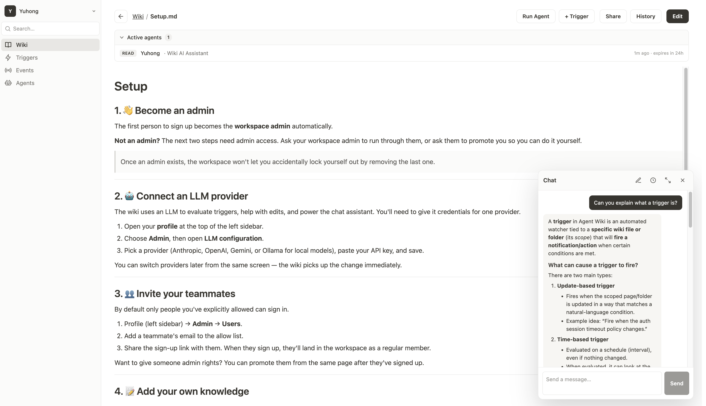

# Agent Wiki

*One day the majority of work and projects is created and tended to by swarms of agents. The agents hum along and chatter amongst themselves, occasionally proclaiming a eureka moment followed by a mad scrambling of implementation. Plans are made, goals are updated, discussions happen and get archived - all in a buzz of activity 1000x faster than the meat computers can process.*

**The idea: A self updating wiki and a workspace for humans and agents to collaborate efficiently. Keep projects self-consistent and coordinate updates between teams of people and agents.**



This project is designed around a few core beliefs:
- The best document format for agent collaboration is Markdown.
- The best representation of hierarchy is a file system.
- The best history management is Git.

## How it works
Agent wiki provides a git backed file system made up of `.md` files that can receive updates from AI agents and other external sources.

### Automatic Updates
The wiki is kept up to date via 3 different pathways:
- Agents can connect via MCP and use information from the wiki and push updates to it as it completes tasks.
- External systems can push information/documents to the wiki via API and a built-in agent will find the right pages and make the updates.
- Human users can directly edit the wiki.

### Update policy
Not every page should be rewritten automatically. Any page — or a whole folder — can carry an **update policy**, edited from its *Update Policy* panel:
- **Auto-update** — turn it off to keep connector/ingestion pushes from rewriting the page (or everything under a folder).
- **Update instructions** — free-text guidance the updater agent honors when it does edit (e.g. "keep entries terse", "never touch the SLA table").

Policies inherit down the tree: a setting on a folder applies to every page beneath it, and a more specific page or subfolder overrides its parent. Like permissions, they're stored per-path (not in the page body), so guidance never leaks into the wiki content.

### Triggers
The wiki changes constantly, but most updates aren't interesting to most people. Triggers let a user say, in plain English, what they care about — "fire when this project's status flips from green to yellow", "fire when a new design doc lands under `projects/`" — scoped to a specific file or directory. Every commit under the scope is evaluated by an LLM against the description; on a match, a second LLM pass renders the owner's notification template into a concrete message about what actually changed.

Events land in an event log and can also be delivered to third-party systems — the wiki can call an API on fire, apps can poll the log, or a webhook can push events as they happen. The same trigger that surfaces "status flipped to yellow" in your feed can also page an on-call channel or kick off a downstream agent/workflow.

## Deployment

Run Agent Wiki with a single command:

```bash
curl -fsSL https://raw.githubusercontent.com/onyx-dot-app/agent-wiki/main/install.sh | bash
```

Or clone the repo and run `docker compose up -d` yourself. Either way, open `http://localhost:8090`, sign up to claim admin, and you're in.

Kubernetes (Helm + optional Terraform for EKS) is also supported — see [`deploy/README.md`](deploy/README.md).
